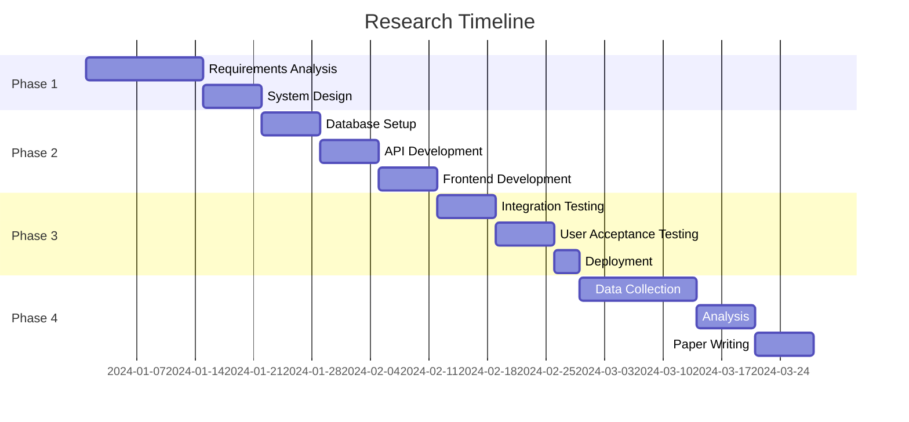

# Research Methodology

## Pendekatan Penelitian untuk Sistem Rekomendasi Parkir Berbasis Jarak

### 1. Research Design

#### 1.1 Jenis Penelitian
- **Applied Research**: Fokus pada solusi praktis untuk masalah dunia nyata
- **Design Science Research**: Mengembangkan artefak teknologi yang inovatif
- **Case Study**: Implementasi pada konteks spesifik (parking lot 5 slot)

#### 1.2 Research Paradigm
- **Pragmatism**: Kombinasi quantitative dan qualitative approaches
- **Positivism**: Emphasis pada measurable outcomes dan performance metrics
- **Constructivism**: Understanding user experience dan perception

### 2. Research Questions & Hypotheses

#### 2.1 Primary Research Questions
1. **RQ1**: Apakah algoritma Euclidean distance cukup efektif untuk sistem rekomendasi parkir skala kecil?
2. **RQ2**: Bagaimana trade-off antara simplicity dan accuracy dalam implementasi MVP?
3. **RQ3**: Apa impact dari pendekatan cost-effective terhadap user satisfaction?

#### 2.2 Secondary Research Questions
1. **RQ4**: Berapa response time yang dapat dicapai dengan pendekatan sederhana?
2. **RQ5**: Bagaimana user behavior terhadap rekomendasi yang diberikan?
3. **RQ6**: Apa scalability limitations dari current approach?

#### 2.3 Research Hypotheses

**H1**: Sistem rekomendasi berbasis Euclidean distance akan mencapai acceptance rate >60%
**H0**: Acceptance rate ≤60%

**H2**: API response time akan consistently <150ms
**H0**: Response time ≥150ms

**H3**: User satisfaction akan ≥4.0/5.0 dengan pendekatan sederhana
**H0**: User satisfaction <4.0/5.0

### 3. Theoretical Framework

#### 3.1 Distance-Based Recommendation Theory
```
Utility Function U(s) = -d(s, e) + Σ(wᵢ × fᵢ(s))

Dimana:
- d(s, e) = jarak Euclidean antara slot s dan entrance e
- wᵢ = weight untuk factor i
- fᵢ(s) = nilai factor i untuk slot s
```

#### 3.2 MVP Theory
- **Lean Startup Principles**: Build-Measure-Learn cycle
- **Minimum Features**: Core functionality tanpa nice-to-have features
- **Iterative Development**: Continuous improvement berdasarkan user feedback

#### 3.3 User Experience Theory
- **Technology Acceptance Model (TAM)**: Perceived usefulness dan ease of use
- **Task-Technology Fit**: Seberapa baik teknologi support user tasks
- **Flow Theory**: Optimal experience dalam technology usage

### 4. Research Methodology

#### 4.1 Development Approach

##### Phase 1: Requirements Analysis (Week 1-2)
**Activities:**
- Stakeholder interviews dengan parking management
- Competitor analysis dari existing parking systems
- User persona development
- Technical feasibility assessment

**Methods:**
- Semi-structured interviews
- Document analysis
- Market research

**Deliverables:**
- Requirements specification document
- System architecture design
- Technology stack selection

##### Phase 2: System Development (Week 3-4)
**Activities:**
- Database design dan setup
- API endpoint development
- Frontend component creation
- Integration testing

**Methods:**
- Agile development methodology
- Test-driven development (TDD)
- Continuous integration

**Deliverables:**
- Functional parking recommendation system
- API documentation
- User interface prototype

##### Phase 3: Implementation & Testing (Week 5-6)
**Activities:**
- Deployment ke production environment
- User acceptance testing (UAT)
- Performance optimization
- Bug fixes dan refinements

**Methods:**
- Beta testing dengan real users
- A/B testing untuk UI variations
- Performance benchmarking

**Deliverables:**
- Production-ready system
- Test reports
- Performance metrics

##### Phase 4: Evaluation & Analysis (Week 7-8)
**Activities:**
- Data collection dari system usage
- User feedback analysis
- Performance evaluation
- Research question validation

**Methods:**
- Quantitative data analysis
- Qualitative user interviews
- Statistical testing

**Deliverables:**
- Research findings report
- Recommendations for improvement
- Academic paper draft

#### 4.2 Data Collection Methods

##### 4.2.1 Quantitative Data Collection

**System Performance Metrics:**
```typescript
interface PerformanceMetrics {
  responseTime: number;      // API response time dalam ms
  throughput: number;        // Requests per minute
  errorRate: number;         // Percentage dari failed requests
  uptime: number;            // System availability percentage
  memoryUsage: number;       // Memory consumption dalam MB
}
```

**User Behavior Analytics:**
```typescript
interface UserAnalytics {
  recommendationRequests: number;  // Total requests made
  recommendationAcceptance: number; // Percentage yang diikuti
  timeToDecision: number;         // Time dari recommendation ke action
  peakUsageHours: number[];       // Jam dengan penggunaan tertinggi
  repeatUsageRate: number;        // Pengguna yang kembali menggunakan
}
```

**Data Collection Tools:**
- Custom analytics dashboard
- Server-side logging
- Client-side event tracking
- Database query performance monitoring

##### 4.2.2 Qualitative Data Collection

**User Feedback Collection:**
- Online surveys dengan Likert scale questions
- Semi-structured interviews dengan users
- Focus group discussions
- Observation studies di parking location

**Survey Questions:**
1. Seberapa mudah menggunakan sistem rekomendasi? (1-5)
2. Apakah rekomendasi membantu menghemat waktu? (1-5)
3. Seberapa akurat rekomendasi slot yang tersedia? (1-5)
4. Apa fitur tambahan yang diinginkan? (Open-ended)

#### 4.3 Sampling Strategy

##### 4.3.1 Target Population
- **Primary Users**: Pengendara yang menggunakan parking lot
- **Secondary Users**: Parking management staff
- **Sample Size**: Minimum 50 users untuk statistical significance

##### 4.3.2 Sampling Method
- **Convenience Sampling**: Users yang available selama research period
- **Purposive Sampling**: Target users dengan specific characteristics
- **Snowball Sampling**: Referral dari existing users

##### 4.3.3 Inclusion Criteria
- Usia 18-65 tahun
- Memiliki SIM yang valid
- Regular parking lot users (minimum 1x/minggu)
- Comfortable dengan technology usage

### 5. Data Analysis Methods

#### 5.1 Quantitative Analysis

##### 5.1.1 Descriptive Statistics
```typescript
// Performance Metrics Analysis
const performanceAnalysis = {
  meanResponseTime: calculateMean(responseTimes),
  medianResponseTime: calculateMedian(responseTimes),
  standardDeviation: calculateStdDev(responseTimes),
  percentiles: {
    p95: calculatePercentile(responseTimes, 95),
    p99: calculatePercentile(responseTimes, 99)
  }
};
```

##### 5.1.2 Hypothesis Testing
**T-test untuk response time:**
```typescript
// One-sample t-test
const tStatistic = (sampleMean - targetValue) / (sampleStdDev / Math.sqrt(sampleSize));
const degreesOfFreedom = sampleSize - 1;
const pValue = calculatePValue(tStatistic, degreesOfFreedom);

if (pValue < 0.05) {
  // Reject null hypothesis
}
```

**Chi-square test untuk acceptance rate:**
```typescript
// Test apakah acceptance rate berbeda signifikan dari expected
const chiSquare = ((observed - expected)²) / expected;
const pValue = calculateChiSquarePValue(chiSquare, degreesOfFreedom);
```

##### 5.1.3 Correlation Analysis
```typescript
// Pearson correlation antara distance dan acceptance
const correlation = calculateCorrelation(distances, acceptanceRates);
```

#### 5.2 Qualitative Analysis

##### 5.2.1 Thematic Analysis
1. **Familiarization**: Membaca semua interview transcripts
2. **Coding**: Identifikasi themes dan patterns
3. **Theme Development**: Group codes ke dalam themes
4. **Review**: Validate themes dengan original data
5. **Definition**: Finalize theme definitions

##### 5.2.2 Content Analysis
- **Frequency Analysis**: Count mentions dari specific topics
- **Sentiment Analysis**: Identify positive/negative/neutral responses
- **Word Cloud Analysis**: Visualize common keywords

### 6. Validation Strategy

#### 6.1 Internal Validity
- **Triangulation**: Multiple data sources untuk cross-validation
- **Member Checking**: Validasi findings dengan participants
- **Peer Debriefing**: Review methodology dengan fellow researchers

#### 6.2 External Validity
- **Replication**: Document methodology untuk future replication
- **Transferability**: Provide detailed context untuk generalization
- **Variation**: Test dengan different user groups dan contexts

#### 6.3 Reliability
- **Inter-rater Reliability**: Multiple coders untuk qualitative data
- **Test-Retest Reliability**: Repeated measurements untuk consistency
- **Instrument Validation**: Pre-test surveys dan interview guides

### 7. Ethical Considerations

#### 7.1 Informed Consent
- Clear explanation tentang research purpose
- Voluntary participation statement
- Right to withdraw information
- Contact information untuk questions

#### 7.2 Data Privacy
- Anonymization dari personal data
- Secure storage untuk research data
- Limited access kepada data
- Data retention policy compliance

#### 7.3 Risk Minimization
- Minimal risk kepada participants
- Technical safeguards untuk system security
- Backup procedures untuk data protection
- Emergency response procedures

### 8. Limitations & Mitigation Strategies

#### 8.1 Technical Limitations
- **Scope**: Hanya 5 parking slots
  - *Mitigation*: Document scalability analysis
- **Algorithm**: Simplified Euclidean distance
  - *Mitigation*: Compare dengan complex alternatives dalam discussion
- **Sample Size**: Limited user base
  - *Mitigation*: Statistical power analysis

#### 8.2 Research Limitations
- **Time Constraint**: 8-week research period
  - *Mitigation*: Focus pada core research questions
- **Single Location**: Satu parking lot location
  - *Mitigation*: Detailed context documentation untuk transferability
- **Researcher Bias**: Potential subjective interpretation
  - *Mitigation*: Multiple coders dan peer review

### 9. Timeline & Milestones



### 10. Success Criteria

#### 10.1 Technical Success Criteria
- [ ] API response time <150ms (95th percentile)
- [ ] System uptime >99%
- [ ] Zero critical bugs dalam production
- [ ] Successful deployment ke production environment

#### 10.2 Research Success Criteria
- [ ] Minimum 50 user participants
- [ ] Statistical significance (p < 0.05) untuk hypotheses
- [ ] Complete data collection untuk semua metrics
- [ ] Academic paper acceptance untuk conference submission

#### 10.3 User Success Criteria
- [ ] User satisfaction ≥4.0/5.0
- [ ] Recommendation acceptance rate >60%
- [ ] Time savings >2 menit per parking session
- [ ] Positive qualitative feedback dari users

---

**Methodology Summary:**
- **Approach**: Mixed-methods dengan quantitative dan qualitative data
- **Duration**: 8 weeks dengan 4 distinct phases
- **Sample Size**: Minimum 50 users untuk statistical significance
- **Validation**: Triangulation dan peer review untuk reliability
- **Ethics**: Informed consent dan data privacy compliance